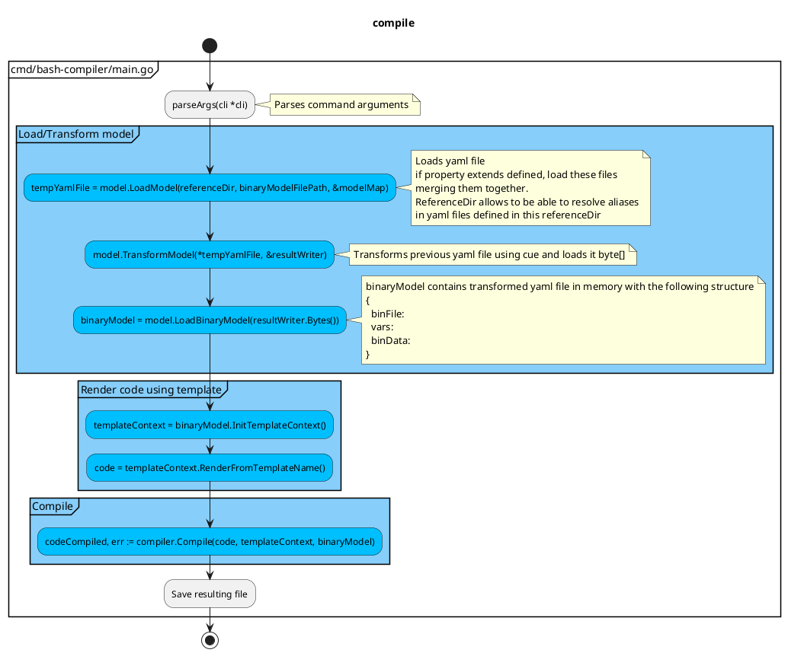
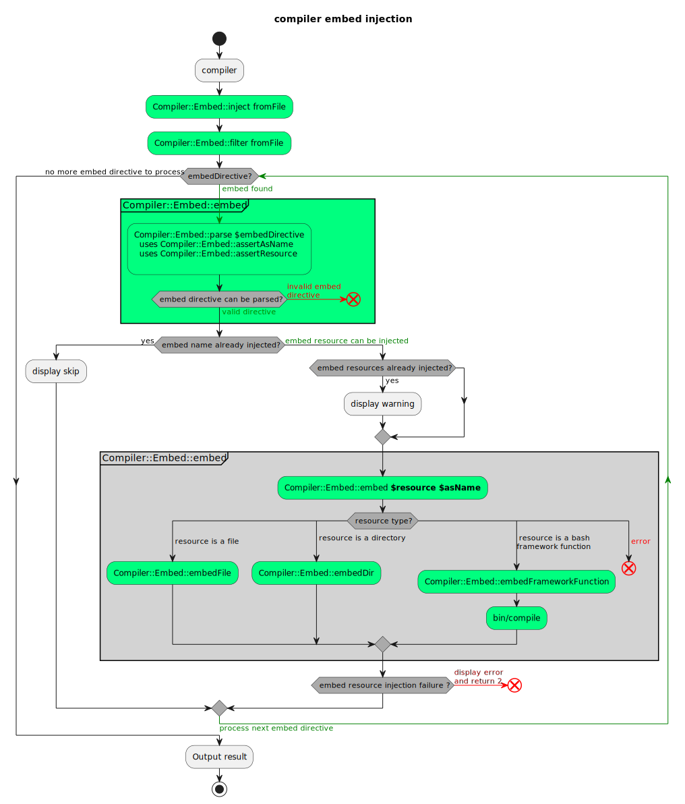

# Compile Command

- [1. What is it ?](#1-what-is-it-)
  - [1.1. Why ?](#11-why-)
  - [1.2. what is a bash framework function ?](#12-what-is-a-bash-framework-function-)
  - [1.3. what does this compiler tool do ?](#13-what-does-this-compiler-tool-do-)
- [2. The compile command](#2-the-compile-command)
- [3. The compiler - How this compiler works ?](#3-the-compiler---how-this-compiler-works-)
  - [3.2. Template variables](#32-template-variables)
  - [3.3. Compiler Algorithm](#33-compiler-algorithm)
  - [3.4. Class diagram](#34-class-diagram)
  - [3.5. directives and template](#35-directives-and-template)
    - [3.5.1. `# FUNCTIONS` directive](#351--functions-directive)
    - [3.5.2. Compiler - Compiler::Requirement::require](#352-compiler---compilerrequirementrequire)
      - [3.5.2.1. Requires dependencies tree](#3521-requires-dependencies-tree)
      - [3.5.2.2. Require example](#3522-require-example)
      - [3.5.2.3. Requires dependencies use cases](#3523-requires-dependencies-use-cases)
    - [3.5.3. `@embed` directive (optional)](#353-embed-directive-optional)
- [4. Best practices](#4-best-practices)
- [5. Acknowledgements](#5-acknowledgements)

## 1. What is it ?

### 1.1. Why ?

Before answering what this tool is, let's begin by why this tool exists ?

Scripts using multiple sourced files are not easy to distribute. We usually
distribute those as archives and rely on the end user to unpack and run them
from a predetermined location. To improve the experience we can instead prepare
a single script with other files embedded inside it.

Here are the goals:

- The script should consist of a single file, making it easy to distribute
- The script should be copy-paste-able between systems and different editors,
  even if multiple hops are required
- Files being embedded can be binary files i.e. can contain non-printable
  characters
- The script allows bash functions reusability

The first requirement implies that we should somehow store the contents of other
files in our main script. The second requires us to avoid non-printable
characters, as they tend to cause problems when performing a copy-paste
operation. Especially when we are talking about sending such characters over
messaging programs.

### 1.2. what is a bash framework function ?

The so called `bash framework functions` are the functions defined in this
framework that respects the following naming convention:

- Namespace::Namespace::functionName
  - we can have any number of namespaces
  - each namespace is followed by ::
  - namespace must begin by an uppercase letter `[A-Z]` followed by any of these
    characters `[A-Za-z0-9_-]`.
  - the function name is traditionally written using camelCase with first letter
    in small case
  - function name authorized characters are `[a-zA-Z0-9_-]+`
- the function source code using namespace convention will be searched under
  srcDirs provided to the compiler via --src-dir argument
  - each namespace corresponds to a folder
  - the filename of the function is the function name with .sh extension
  - eg: Filters::camel2snakeCase source code can be found in
    src/Filters/camel2snakeCase.sh

### 1.3. what does this compiler tool do ?

This tool allows to detect all the framework functions used inside a given sh
file. The framework functions matches the pattern `Namespace::functionName` (we
can have several namespaces separated by the characters `::`). These framework
functions will be injected inside a compiled file. The process is recursive so
that every framework functions used by imported framework functions will be
imported as well (of course only once).

You can see several examples of compiled files by checking
[bash-tools-framework src/\_binaries folder](https://github.com/fchastanet/bash-tools-framework/tree/master/src/_binaries)

## 2. The compile command

<!-- markdownlint-disable MD033 -->

<!-- markdownlint-capture -->

<a name="compileCommandHelp"></a>

<!-- markdownlint-restore -->

**Description:** This command inlines all the functions used in the script given
in parameter

**Usage:**

```text
bin/compile` [-h|--help] prints this help and exits
```

**Usage:**

```text
bin/compile <fileToCompile>
            [--src-dir|-s <srcDir>]
            [--bin-dir|-b <binDir>] [--bin-file|-f <binFile>]
            [--root-dir|-r <rootDir>] [--src-path <srcPath>]
            [--template <templateName>] [--keep-temp-files|-k]
```

**Mandatory Arguments:**

- `<fileToCompile>` the relative or absolute path to compile into one file

**Options:**

- `--help,-h` prints this help and exits

- `--src-dir|-s <srcDir>` provide the directory where to find the functions
  source code. By default this project src directory is used.

  You can add as much --src-dir options as needed to define other source dirs.

  The functions will be searched in the order defined (it allows function
  redefinition)

  _Example:_ `--src-dir src --src-dir otherSrc`

  `Functions::myFunction` will be searched in

  - src/Functions/myFunction.sh
  - otherSrc/Functions/myFunction.sh

  **Important Note:** if you provide a `--src-dir` and you need also functions
  defined in this project, think about adding a `--src-dir` for this project
  too.

- `--bin-dir|-b <binDir>` allows to override the value of `FRAMEWORK_BIN_DIR`.
  By default FRAMEWORK_BIN_DIR is set to `bin` directory below the folder above
  `bin/compile`.

- `--bin-file|-f <binFile>` `BIN_FILE` directive will be overridden by `binFile`
  value. See more information below about directives.

- `--template-dir|-t <templateDir>` the template directory used to override some
  template includes. See more information below about environment variables.

- `--root-dir|-r <rootDir>` if you wish to override `FRAMEWORK_ROOT_DIR`
  variable.

  By default root directory is the folder above `bin/compile`.

- `--src-path <path>` if you wish to override the filepath that will be
  displayed in the header to indicate the src filepath that has been compiled
  (`SRC_FILE_PATH`).

  By default, it is initialized with path relative to `FRAMEWORK_ROOT_DIR`

- `--keep-temp-files|-k` keep temporary files for debug purpose

_Examples:_

Let's say you want to generate the binary file `bin/buildDoc` from the source
file `src/build/buildDoc.sh`

```bash
bin/compile "$(pwd)/src/_binaries/doc.sh" --src-dir "$(pwd)/src" \
  --bin-dir "$(pwd)/bin" --root-dir "$(pwd)"
```

Here you want to generate the binary but overriding some or all functions of
`vendor/bash-tools-framework/src` using `src` folder

```bash
bin/compile "$(pwd)/src/_binaries/doc.sh" --s "$(pwd)/src" \
  -s "$(pwd)/vendor/bash-tools-framework/src" --bin-dir "$(pwd)/bin" --root-dir "$(pwd)"
```

Here you want to override the default templates too

```bash
bin/compile "$(pwd)/src/_binaries/doc.sh" --s "$(pwd)/src" \
  -s "$(pwd)/vendor/bash-tools-framework/src" --bin-dir "$(pwd)/bin" \
  --root-dir "$(pwd)" --template-dir "$(pwd)/src/templates"
```

## 3. The compiler - How this compiler works ?

### 3.2. Template variables

Other variables are automatically generated to be used in your templates:

- `ORIGINAL_TEMPLATE_DIR` allowing you to include the template relative to the
  script being interpreted
- `TEMPLATE_DIR` the template directory in which you can override the templates
  defined in `ORIGINAL_TEMPLATE_DIR`

The following variables depends upon parameters passed to this script:

- `SRC_FILE_PATH` the src file you want to show at the top of generated file to
  indicate from which source file the binary has been generated.
- `SRC_ABSOLUTE_PATH` is the path of the file being compiled, it can be useful
  if you need to access a path relative to this file during compilation.

### 3.3. Compiler Algorithm

The command to generate a bash binary file:

```bash
./bin/bash-compiler examples/configReference/shellcheckLint.yaml \
  --root-dir /home/wsl/fchastanet/bash-dev-env/vendor/bash-tools-framework \
  --target-dir examples/generated \
  --keep-intermediate-files
```

This will trigger the following actions



### 3.4. Class diagram

```plantuml
@startuml "bash-compiler class diagram"
!pragma layout elk

!include doc/classDiagram.puml
@enduml
```

```plantuml
@startuml "bash-compiler class diagram with private methods"
!pragma layout elk

!include doc/classDiagramWithPrivateMethods.puml
@enduml
```

### 3.5. directives and template

You can use special optional directives in src file

- `# FUNCTIONS` mandatory directive
- `@embed` directive
- `@require` directive

Compile command allows to generate a binary file using some directives directly
inside the src file.

Eg:

```bash
#!/usr/bin/env bash
# BIN_FILE=${FRAMEWORK_ROOT_DIR}/bin/binaryExample
# @embed "Backup::file" as backupFile
# @embed "${FRAMEWORK_ROOT_DIR}/bin/otherNeededBinary" AS "otherNeededBinary"
# FACADE

sudo "${embed_file_backupFile}" # ...
"${embed_file_otherNeededBinary}"
# ...
```

The above file header allows to generate the `bin/binaryExample` binary file. It
uses `@embed` directive to allow the usage of `Backup::file` function as a
binary, named backupFile that can even be called using `sudo`.

In previous example, the directive `# FUNCTIONS` is injected via the file
`_includes/facadeDefault/facadeDefault.tpl`.

The srcFile should contains at least the directive `BIN_FILE` at top of the bash
script file (see example above).

#### 3.5.1. `# FUNCTIONS` directive

It is the most important directive as it will inform the compiler where
dependent framework functions will be injected in your resulting bash file.

#### 3.5.2. Compiler - Compiler::Requirement::require

The compiler during successive passes:

- use existing compiler passes (injectImportedFunctions)
  - will parse `# @require` directives of each newly injected functions
    - error if require name does not begin with require
    - error if require name does not comply naming convention
    - error if `require*` file not found
  - will ignore the disabled requirements
  - a tree of require dependencies will be computed
  - we inject gradually the framework functions linked to the requires functions
- At the end of compiler processing
  - inject the requirements calls in the order specified by dependency tree (see
    below).

##### 3.5.2.1. Requires dependencies tree

The following rules apply:

- Some requirements can depends on each others, the compiler will compute which
  dependency should be loaded before the other. _Eg:_ Log::requireLoad
  requirement depends on Framework::requireRootDir, so Framework::requireRootDir
  is loaded before. But Log requirement depends also on Env::requireLoad
  requirement.
- Requirement can be set at namespace level by adding the directive in `_.sh`
  file or at function level.
- A requirement can be loaded only once.
- A requirement that is used by several functions will be more prioritized and
  will be loaded before a less prioritized requirement.
- `# FUNCTIONS` placeholder should be defined before `# REQUIREMENTS`
  placeholder
- `# REQUIREMENTS` placeholder should be defined before `# ENTRYPOINT`
  placeholder

##### 3.5.2.2. Require example

The annotation @require added to a function like in this example:

```bash
# @require Env::requireLoad
# @require Log::requireLoad
Log::logMessage() {
  # rest of the function content
}
```

will do the following actions:

- compiler checks that the required functions exist, if not an error is
  triggered.
- compiler adds code to the required function that will set an environment
  variable to 1 when the function is called (eg:
  REQUIRE_FUNCTION_ENV_REQUIRE_LOAD_LOADED=1).
- compiler adds code to the function that has these requirements in to check if
  these environment variables are set and exit 1 if not.
- compiler checks if the function is called at least once but it is the
  developer's responsibility to call the require function at the right place.

Code is generated using go templates. The go templates are configured in the
yaml file at compiler config level.

```yaml
compilerConfig:
  annotationsConfig:
    requireTemplate: require
    checkRequirementsTemplate: checkRequirements
# rest of the config file content
```

`examples/templates/annotations/require.gtpl` => generates this code:

```bash
Env::RequireLoad() {
  REQUIRE_FUNCTION_ENV_REQUIRE_LOAD_LOADED=1
  # rest of the function content
}
```

`examples/templates/annotations/checkRequirements.gtpl` => generates this code:

```bash
# @require Env::requireLoad
# @require Log::requireLoad
Log::logMessage() {
  if [[ "${REQUIRE_FUNCTION_ENV_REQUIRE_LOAD_LOADED:-0}" != 1 ]]; then
    echo >&2 "Requirement Env::requireLoad has not been loaded"
    exit 1
  fi

  if [[ "${REQUIRE_FUNCTION_LOG_REQUIRE_LOAD_LOADED:-0}" != 1 ]]; then
    echo >&2 "Requirement Log::requireLoad has not been loaded"
    exit 1
  fi
  # rest of the function content
}
```

The aims of a require are the following:

- be to be able to test for a requirement just before executing a function that
  is marked with @require
- when compiling be able to know if a function with a specific requirement has
  been used (eg: ubuntu>20)
- There are several kind of requirements:
  - checking that a command is available
    - this requirement needs to be called at the proper level if the binary
      actually installs this command.
    - @require Aws::requireAwsCommand
    - @require Docker::requireDockerCommand
    - @require Git::requireGitCommand
    - @require Linux::requireCurlCommand
    - @require Linux::requireJqCommand
    - @require Linux::requireRealpathCommand
    - @require Linux::requirePathchkCommand
    - @require Linux::requireSudoCommand
    - @require Linux::requireTarCommand
    - @require Ssh::requireSshKeygenCommand
    - @require Ssh::requireSshKeyscanCommand
  - checking a feature is available
    - @require Git::requireShallowClone actually based on git version
  - checking a specific environment/state is available on execution
    - @require Linux::requireUbuntu
    - @require Linux::Wsl::requireWsl
    - @require Linux::requireExecutedAsUser
    - ubuntu>20
  - ensuring some specific loading are made
    - @require Env::requireLoad
    - @require Log::requireLoad
    - @require UI::requireTheme

##### 3.5.2.3. Requires dependencies use cases

_Script file example:_

```bash
# FUNCTIONS placeholder
# REQUIRES placeholder
Linux::Apt::update || Log::displayError "impossible to update"
```

- first compiler injectImportedFunctions pass
  - `Linux::Apt::update` requires
    - `Linux::requireSudoCommand`
    - `Linux::requireUbuntu`
  - `Log::display*` requires `Colors::requireTheme`
- second compiler injectImportedFunctions pass
  - `Log::log*` requires `Log::requireLoad`
- third compiler injectImportedFunctions pass
  - `Log::requireLoad` requires `Env::requireLoad`
- fourth compiler injectImportedFunctions pass
  - `Env::requireLoad` requires
    - `Framework::requireRootDir`
    - `Framework::tmpFileManagement` (see `src/_includes/_commonHeader.sh`)
- fifth compiler injectImportedFunctions pass
  - `Framework::tmpFileManagement` requires
    - `Framework::requireRootDir` which is already in the required list

If we order the requirements following reversed pass order, we end up with:

- `Framework::tmpFileManagement`
- `Framework::requireRootDir`
  - here we have an issue as it should come before
    `Framework::tmpFileManagement`
  - a solution could be to add the element to require list even if it is already
    in the list. This way it could even give a weight at certain requires.
- `Env::requireLoad`
- `Log::requireLoad`
- `Colors::requireTheme`
- `Linux::requireUbuntu`
- `Linux::requireSudoCommand`

To take into consideration:

- at each pass, we will parse the full list of functions and requires
  - it means the array of requires has to be reset at each pass.

Let's take again our above example, pass by pass (we avoided to include some
functions intentionally like `Retry:default` needed by `Linux::Apt::update` to
make example easier to understand).

_Pass #1:_ import functions Linux::Apt::update and Log::displayError

```bash
# @require Linux::requireSudoCommand
# @require Linux::requireUbuntu
Linux::Apt::update() { :; }
# @require Log::requireLoad
Log::displayError() {
  #...
  Log:logMessage #...
}
# FUNCTIONS placeholder
# we don't have any yet as we are still parsing the 3 lines
# code above.
# REQUIRES placeholder
Linux::Apt::update || Log::displayError "impossible to update"
```

Functions imported list so far:

- Linux::Apt::update
- Log::displayError

_Pass #2:_ import functions Log:logMessage and import required functions in
reverse order Linux::requireSudoCommand, Linux::requireUbuntu, Log::requireLoad
_Note:_ remember that require functions are only filtered using `# @require`

```bash
# @require Linux::requireSudoCommand
# @require Linux::requireUbuntu
Linux::Apt::update() { :; }
# @require Log::requireLoad
Log::displayError() {
  #...
  Log:logMessage #...
}
Log:logMessage() { :; }
Linux::requireSudoCommand() { :; }
Linux::requireUbuntu() { :; }
# @require Env::requireLoad
Log::requireLoad() { :; }
# FUNCTIONS placeholder

Log::requireLoad
Linux::requireUbuntu
Linux::requireSudoCommand
# REQUIRES placeholder
Linux::Apt::update || Log::displayError "impossible to update"
```

Functions imported list so far:

- Linux::Apt::update
- Log::displayError
- Log:logMessage
- Log::requireLoad
- Linux::requireSudoCommand
- Linux::requireUbuntu

_Pass #3:_ import functions, import required functions will import
Env::requireLoad so order of requires will be:

```bash
Env:requireLoad
Log::requireLoad
Linux::requireUbuntu
Linux::requireSudoCommand
```

#### 3.5.3. `@embed` directive (optional)

<!-- markdownlint-capture -->

<!-- markdownlint-disable MD033 -->

<a name="embed_include" id="embed_include"></a>

<!-- markdownlint-restore -->

Allows to embed as base64 encoded a file or a directory. The following syntax
can be used:

_Syntax:_ `# @embed "srcFile" as "targetFile"`

_Syntax:_ `# @embed "srcDir" as "targetDir"`

if `@embed` directive is provided, the file/dir provided will be added inside
the resulting bin file as a tar gz file(base64 encoded) and automatically
extracted when used.

The @embed annotation allows to embed as base64 encoded a file or a directory.

The syntax is the following:

```bash
# @embed "${FRAMEWORK_ROOT_DIR}/README.md" as readme
# @embed "${FRAMEWORK_ROOT_DIR}/.cspell" as cspell
```

This will generate the code below:

```bash
Compiler::Embed::extractFileFromBase64 \
  "${PERSISTENT_TMPDIR:-/tmp}/1e26600f34bdaf348803250aa87f4924/readme" \
  "base64 encode string" \
  "644"

declare -gx embed_file_readme="${PERSISTENT_TMPDIR:-/tmp}/1e26600f34bdaf348803250aa87f4924/readme"

Compiler::Embed::extractDirFromBase64 \
  "${PERSISTENT_TMPDIR:-/tmp}/5c12a039d61ab2c98111e5353362f380/cspell" \
  "base64 encode string"

declare -gx embed_dir_cspell="${PERSISTENT_TMPDIR:-/tmp}/5c12a039d61ab2c98111e5353362f380/cspell"
```

The embedded files will be automatically uncompressed.



[activity diagram source code](https://github.com/fchastanet/bash-compiler/blob/master/doc/embedActivityDiagram.puml).

See [compiler - Compiler::Embed::embed](#embed_include) below for more
information.

## 4. Best practices

`@embed` keyword is really useful to inline configuration files. However to run
framework function using sudo, it is recommended to call the same binary but
passing options to change the behavior. This way the content of the script file
does not seem to be obfuscated.

## 5. Acknowledgements

I want to thank a lot Michał Zieliński(Tratif company) for this wonderful
article that helped me a lot in the conception of the file/dir/framework
function embedding feature.

for more information see
[Bash Tips #6 – Embedding Files In A Single Bash Script](https://blog.tratif.com/2023/02/17/bash-tips-6-embedding-files-in-a-single-bash-script/)
