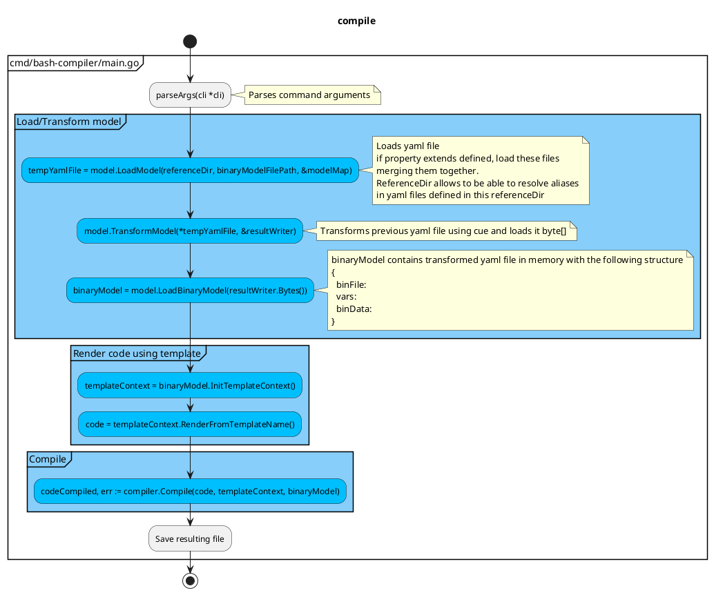

# Bash Compiler

[](https://github.com/SchwarzIT/go-template)

<!-- markdownlint-capture -->

<!-- markdownlint-disable MD013 -->

[](https://github.com/fchastanet/bash-compiler/releases)
[](https://github.com/fchastanet/bash-compiler/blob/master/LICENSE)
[](https://github.com/fchastanet/bash-compiler/actions?query=workflow%3A%22Lint+and+test%22+branch%3Amaster)
[](http://opensource.box.com/badges "Project Status")
[](https://deepsource.io/gh/fchastanet/bash-compiler/?ref=repository-badge)
[](https://deepsource.io/gh/fchastanet/bash-compiler/?ref=repository-badge)
[](http://isitmaintained.com/project/fchastanet/bash-compiler "Average time to resolve an issue")
[](http://isitmaintained.com/project/fchastanet/bash-compiler "Percentage of issues still open")

<!-- markdownlint-restore -->

- [1. Excerpt](#1-excerpt)
- [2. Documentation](#2-documentation)
  - [2.1. Go Libraries used](#21-go-libraries-used)
  - [2.1.1. Template system](#211-template-system)
  - [Compiler Algorithm](#compiler-algorithm)
  - [Class diagram](#class-diagram)
- [3. Development](#3-development)
  - [3.1. Pre-commit hook](#31-pre-commit-hook)
  - [3.2. Build/run/clean](#32-buildrunclean)
    - [3.2.1. Build](#321-build)
    - [3.2.2. Tests](#322-tests)
    - [3.2.3. Coverage](#323-coverage)
    - [3.2.4. run the binary](#324-run-the-binary)
    - [3.2.5. Clean](#325-clean)
- [4. Commands](#4-commands)
- [5. Alternatives](#5-alternatives)

## 1. Excerpt

This tool allows to detect all the framework functions used inside a given sh
file. The framework functions matches the pattern Namespace::functionName (we
can have several namespaces separated by the characters ::). These framework
functions will be injected inside a compiled file. The process is recursive so
that every framework functions used by imported framework functions will be
imported as well (of course only once).

## 2. Documentation

### 2.1. Go Libraries used

- [slog](https://pkg.go.dev/golang.org/x/exp/slog) is logging system
  - [slog tutorial](https://betterstack.com/community/guides/logging/logging-in-go/#customizing-the-default-logger)
- [Yaml parser](https://github.com/goccy/go-yaml) is used to load template data
  from yaml file
- [Kong](github.com/alecthomas/kong) used for command arguments parsing
- [cuelang](cuelang.org/go) allows to transform yaml file in another one

### 2.1.1. Template system

[template system](https://pkg.go.dev/text/template@go1.22.3)
[doc 1](https://lets-go.alexedwards.net/sample/02.08-html-templating-and-inheritance.html)

There is the choice between Go template/text or template/html libraries. I
chosen template/text to avoid some escaping that are not needed in bash.

Go template/text or template/html don't provide any execution context to the
filters (FuncMap).

I'm not using Template.ParseGlob because I have to call it twice to include
files of root directory and sub directories with 2 glob patterns. But a bug in
text/template makes the template be initialized again after each calls to
ParseGlob function. So I compute manually list of templates in
internal/render/render.go NewTemplate function.

I simulated a context by pushing the context to the render function. So the data
associated to the template has the following structure:

```go
type Context struct {
	Template *template.Template
	Name     string
	RootData any
	Data     any
}
```

- Template points to the first template that has been rendered
- Name is the name of the first template that has been rendered
- RootData are the data that have been sent at the start of the rendering
- Data are the data sent to the sub template (possibly a part of RootData or the
  whole RootData)

Then each filter has to be called with the right context. The special filter
`include` allows to include a sub template overriding context Data.

Template filter functions, `internal/render/functions/index.go` includes:

- [Sprig filter functions](https://github.com/Masterminds/sprig)
  - Sprig is not maintained anymore, a possible alternate fork is
    [sprout](https://github.com/go-sprout/sprout) but it misses a lot of
    functions.
- my own templates functions
  - string functions
    - stringLength
    - format allow to format string like in this example
      - `{{ format "${%sLongDescription[@]}" .functionName }}`
  - templates functions
    - include: allows to include a template by template name allowing to use
      filter
    - includeFile: allows to include a template by filename
    - includeFileAsTemplate: same as includeFile but interpreting the file as a
      template
    - dynamicFile: resolve first matching filepath in paths provided as argument

### Compiler Algorithm

The command to generate a bash binary file:

```bash
FRAMEWORK_ROOT_DIR=/home/wsl/fchastanet/bash-dev-env/vendor/bash-tools-framework \
  ./bin/bash-compiler examples/configReference/shellcheckLint.yaml \
  --target-dir examples/generated \
  --keep-intermediate-files
```

This will trigger the following actions



### Class diagram

```plantuml
@startuml "bash-compiler class diagram"
!pragma layout elk

!include doc/classDiagram.puml
@enduml
```

```plantuml
@startuml "bash-compiler class diagram with private methods"
!pragma layout elk

!include doc/classDiagramWithPrivateMethods.puml
@enduml
```

## 3. Development

### 3.1. Pre-commit hook

This repository uses pre-commit software to ensure every commits respects a set
of rules specified by the `.pre-commit-config.yaml` file. It supposes pre-commit
software is [installed](https://pre-commit.com/#install) in your environment.

You also have to execute the following command to enable it:

```bash
pre-commit install --hook-type pre-commit --hook-type pre-push
```

Now each time you commit or push, some linters/compilation tools are launched
automatically

### 3.2. Build/run/clean

Formatting is managed exclusively by pre-commit hooks.

#### 3.2.1. Build

```bash
build/build-docker.sh
```

```bash
build/build-local.sh
```

#### 3.2.2. Tests

```bash
build/test.sh
```

#### 3.2.3. Coverage

```bash
build/coverage.sh
```

#### 3.2.4. run the binary

```bash
build/run.sh
```

#### 3.2.5. Clean

```bash
build/clean.sh
```

## 4. Commands

Generate yaml file:

```bash
go run examples/config-tpl/merge.go >examples/config/shellcheckLint-generated.yaml
```

Transform and validate yaml file

```bash
cue export -l input: examples/config/shellcheckLint-generated.yaml examples/config/binFile.cue --out yaml -e output >examples/config/shellcheckLint-transformed.yaml
```

Compile bin file

```bash
FRAMEWORK_ROOT_DIR=/home/wsl/fchastanet/bash-dev-env/vendor/bash-tools-framework go run ./cmd/bash-compiler/main.go examples/config/shellcheckLint-transformed.yaml
```

## 5. Alternatives

- Convert ecmascript to bash
  - <https://github.com/Ph0enixKM/Amber> alpha version - 2024-05-25
