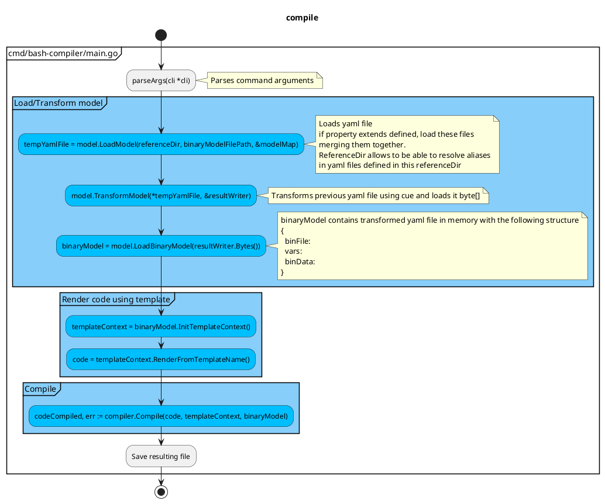

# Bash Compiler

[](https://github.com/SchwarzIT/go-template)

<!-- markdownlint-capture -->

<!-- markdownlint-disable MD013 -->

[](https://github.com/fchastanet/bash-compiler/releases)
[](https://github.com/fchastanet/bash-compiler/blob/master/LICENSE)
[](https://github.com/fchastanet/bash-compiler/actions?query=workflow%3A%22Lint+and+test%22+branch%3Amaster)
[](http://opensource.box.com/badges "Project Status")
[](https://deepsource.io/gh/fchastanet/bash-compiler/?ref=repository-badge)
[](https://deepsource.io/gh/fchastanet/bash-compiler/?ref=repository-badge)
[](http://isitmaintained.com/project/fchastanet/bash-compiler "Average time to resolve an issue")
[](http://isitmaintained.com/project/fchastanet/bash-compiler "Percentage of issues still open")

<!-- markdownlint-restore -->

- [1. Excerpt](#1-excerpt)
- [2. Documentation](#2-documentation)
  - [2.1. Go Libraries used](#21-go-libraries-used)
  - [2.2. Template system](#22-template-system)
  - [2.3. Compiler Algorithm](#23-compiler-algorithm)
  - [2.4. Class diagram](#24-class-diagram)
  - [2.5. Compiler annotations](#25-compiler-annotations)
    - [2.5.1. @require](#251-require)
  - [2.6. @embed](#26-embed)
- [3. Development](#3-development)
  - [3.1. Pre-commit hook](#31-pre-commit-hook)
    - [3.1.1. @embed](#311-embed)
  - [3.2. Build/run/clean](#32-buildrunclean)
    - [3.2.1. Build](#321-build)
    - [3.2.2. Tests](#322-tests)
    - [3.2.3. Coverage](#323-coverage)
    - [3.2.4. run the binary](#324-run-the-binary)
    - [3.2.5. Clean](#325-clean)
- [4. Commands](#4-commands)
- [5. Alternatives](#5-alternatives)

## 1. Excerpt

This tool allows to detect all the framework functions used inside a given sh
file. The framework functions matches the pattern Namespace::functionName (we
can have several namespaces separated by the characters ::). These framework
functions will be injected inside a compiled file. The process is recursive so
that every framework functions used by imported framework functions will be
imported as well (of course only once).

## 2. Documentation

### 2.1. Go Libraries used

- [slog](https://pkg.go.dev/golang.org/x/exp/slog) is logging system
  - [slog tutorial](https://betterstack.com/community/guides/logging/logging-in-go/#customizing-the-default-logger)
- [Yaml parser](https://github.com/goccy/go-yaml) is used to load template data
  from yaml file
- [Kong](https://github.com/alecthomas/kong) used for command arguments parsing
- [cuelang](https://github.com/cue-lang/cue) allows to transform yaml file in
  another one

### 2.2. Template system

[template system](https://pkg.go.dev/text/template@go1.22.3)
[doc 1](https://lets-go.alexedwards.net/sample/02.08-html-templating-and-inheritance.html)

There is the choice between Go template/text or template/html libraries. I
chosen template/text to avoid some escaping that are not needed in bash.

Go template/text or template/html don't provide any execution context to the
filters (FuncMap).

I'm not using Template.ParseGlob because I have to call it twice to include
files of root directory and sub directories with 2 glob patterns. But a bug in
text/template makes the template be initialized again after each calls to
ParseGlob function. So I compute manually list of templates in
internal/render/render.go NewTemplate function.

I simulated a context by pushing the context to the render function. So the data
associated to the template has the following structure:

```go
type Context struct {
	Template *template.Template
	Name     string
	RootData any
	Data     any
}
```

- Template points to the first template that has been rendered
- Name is the name of the first template that has been rendered
- RootData are the data that have been sent at the start of the rendering
- Data are the data sent to the sub template (possibly a part of RootData or the
  whole RootData)

Then each filter has to be called with the right context. The special filter
`include` allows to include a sub template overriding context Data.

Template filter functions, `internal/render/functions/index.go` includes:

- [Sprig filter functions](https://github.com/Masterminds/sprig)
  - Sprig is not maintained anymore, a possible alternate fork is
    [sprout](https://github.com/go-sprout/sprout) but it misses a lot of
    functions.
- my own templates functions
  - string functions
    - stringLength
    - format allow to format string like in this example
      - `{{ format "${%sLongDescription[@]}" .functionName }}`
  - templates functions
    - include: allows to include a template by template name allowing to use
      filter
    - includeFile: allows to include a template by filename
    - includeFileAsTemplate: same as includeFile but interpreting the file as a
      template
    - dynamicFile: resolve first matching filepath in paths provided as argument

### 2.3. Compiler Algorithm

The command to generate a bash binary file:

```bash
./bin/bash-compiler examples/configReference/shellcheckLint.yaml \
  --root-dir /home/wsl/fchastanet/bash-dev-env/vendor/bash-tools-framework \
  --target-dir examples/generated \
  --keep-intermediate-files
```

This will trigger the following actions



### 2.4. Class diagram

```plantuml
@startuml "bash-compiler class diagram"
!pragma layout elk

!include doc/classDiagram.puml
@enduml
```

```plantuml
@startuml "bash-compiler class diagram with private methods"
!pragma layout elk

!include doc/classDiagramWithPrivateMethods.puml
@enduml
```

### 2.5. Compiler annotations

#### 2.5.1. @require

The annotation @require added to a function like in this example:

```bash
# @require Env::requireLoad
# @require Log::requireLoad
Log::logMessage() {
  # rest of the function content
}
```

will do the following actions:

- compiler checks that the required functions exist, if not an error is
  triggered.
- compiler adds code to the required function that will set an environment
  variable to 1 when the function is called (eg:
  REQUIRE_FUNCTION_ENV_REQUIRE_LOAD_LOADED=1).
- compiler adds code to the function that has these requirements in to check if
  these environment variables are set and exit 1 if not.
- compiler checks if the function is called at least once but it is the
  developer's responsibility to call the require function at the right place.

Code is generated using go templates. The go templates are configured in the
yaml file at compiler config level.

```yaml
compilerConfig:
  annotationsConfig:
    requireTemplate: require
    checkRequirementsTemplate: checkRequirements
# rest of the config file content
```

`examples/templates/annotations/require.gtpl` => generates this code:

```bash
Env::RequireLoad() {
  REQUIRE_FUNCTION_ENV_REQUIRE_LOAD_LOADED=1
  # rest of the function content
}
```

`examples/templates/annotations/checkRequirements.gtpl` => generates this code:

```bash
# @require Env::requireLoad
# @require Log::requireLoad
Log::logMessage() {
  if [[ "${REQUIRE_FUNCTION_ENV_REQUIRE_LOAD_LOADED:-0}" != 1 ]]; then
    echo >&2 "Requirement Env::requireLoad has not been loaded"
    exit 1
  fi

  if [[ "${REQUIRE_FUNCTION_LOG_REQUIRE_LOAD_LOADED:-0}" != 1 ]]; then
    echo >&2 "Requirement Log::requireLoad has not been loaded"
    exit 1
  fi
  # rest of the function content
}
```

The aims of a require are the following:

- be to be able to test for a requirement just before executing a function that
  is marked with @require
- when compiling be able to know if a function with a specific requirement has
  been used (eg: ubuntu>20)
- There are several kind of requirements:
  - checking that a command is available
    - this requirement needs to be called at the proper level if the binary
      actually installs this command.
    - @require Aws::requireAwsCommand
    - @require Docker::requireDockerCommand
    - @require Git::requireGitCommand
    - @require Linux::requireCurlCommand
    - @require Linux::requireJqCommand
    - @require Linux::requireRealpathCommand
    - @require Linux::requirePathchkCommand
    - @require Linux::requireSudoCommand
    - @require Linux::requireTarCommand
    - @require Ssh::requireSshKeygenCommand
    - @require Ssh::requireSshKeyscanCommand
  - checking a feature is available
    - @require Git::requireShallowClone actually based on git version
  - checking a specific environment/state is available on execution
    - @require Linux::requireUbuntu
    - @require Linux::Wsl::requireWsl
    - @require Linux::requireExecutedAsUser
    - ubuntu>20
  - ensuring some specific loading are made
    - @require Env::requireLoad
    - @require Log::requireLoad
    - @require UI::requireTheme

### 2.6. @embed

The @embed annotation allows to embed as base64 encoded a file or a directory.

The syntax is the following:

```bash
# @embed "${FRAMEWORK_ROOT_DIR}/README.md" as readme
# @embed "${FRAMEWORK_ROOT_DIR}/.cspell" as cspell
```

This will generate the code below:

```bash
Compiler::Embed::extractFileFromBase64 \
  "${PERSISTENT_TMPDIR:-/tmp}/1e26600f34bdaf348803250aa87f4924/readme" \
  "base64 encode string" \
  "644"

declare -gx embed_file_readme="${PERSISTENT_TMPDIR:-/tmp}/1e26600f34bdaf348803250aa87f4924/readme"

Compiler::Embed::extractDirFromBase64 \
  "${PERSISTENT_TMPDIR:-/tmp}/5c12a039d61ab2c98111e5353362f380/cspell" \
  "base64 encode string"

declare -gx embed_dir_cspell="${PERSISTENT_TMPDIR:-/tmp}/5c12a039d61ab2c98111e5353362f380/cspell"
```

The embedded files will be automatically uncompressed.

## 3. Development

### 3.1. Pre-commit hook

This repository uses pre-commit software to ensure every commits respects a set
of rules specified by the `.pre-commit-config.yaml` file. It supposes pre-commit
software is [installed](https://pre-commit.com/#install) in your environment.

You also have to execute the following command to enable it:

```bash
pre-commit install --hook-type pre-commit --hook-type pre-push
```

Now each time you commit or push, some linters/compilation tools are launched
automatically

#### 3.1.1. @embed

Allows to embed files, directories or a framework function. The following syntax
can be used:

_Syntax:_ `# @embed "srcFile" AS "targetFile"`

_Syntax:_ `# @embed "srcDir" AS "targetDir"`

if `@embed` annotation is provided, the file/dir provided will be added inside
the resulting bin file as a tar gz file(base64 encoded) and automatically
extracted when executed.

The compiler's embed annotation offers the ability to embed files or
directories. `annotationEmbed` allows to:

- **include a file**(binary or not) as base64 encoded, the file can then be
  extracted using the automatically generated method
  `Compiler::Embed::extractFile_asName` where asName is the name chosen using
  annotation explained above. The original file mode will be restored after
  extraction. The variable `embed_file_asName` contains the targeted filepath.
- **include a directory**, the directory will be tar gz and added to the
  compiled file as base64 encoded string. The directory can then be extracted
  using the automatically generated method `Compiler::Embed::extractDir_asName`
  where asName is the name chosen using annotation explained above. The variable
  embed_dir_asName contains the targeted directory path.
- **include a bash framework function**, a special binary file that simply calls
  this function will be automatically generated. This binary file will be added
  to the compiled file as base64 encoded string. Then it will be automatically
  extracted to temporary directory and is callable directly using `asName`
  chosen above because path of the temporary directory has been added into the
  PATH variable.

### 3.2. Build/run/clean

Formatting is managed exclusively by pre-commit hooks.

#### 3.2.1. Build

```bash
build/build-docker.sh
```

```bash
build/build-local.sh
```

#### 3.2.2. Tests

```bash
build/test.sh
```

#### 3.2.3. Coverage

```bash
build/coverage.sh
```

#### 3.2.4. run the binary

```bash
build/run.sh
```

#### 3.2.5. Clean

```bash
build/clean.sh
```

## 4. Commands

Compile bin file

```bash
go run ./cmd/bash-compiler examples/configReference/shellcheckLint.yaml \
  --root-dir /home/wsl/fchastanet/bash-dev-env/vendor/bash-tools-framework \
  -t examples/generated -k -d
```

for debugging purpose, manually Transform and validate yaml file using cue

```bash
cue export \
  -l input: examples/generated/shellcheckLint-merged.yaml \
  internal/model/binFile.cue --out yaml \
  -e output >examples/generated/shellcheckLint-cue-transformed.yaml
```

## 5. Alternatives

- Convert ecmascript to bash
  - <https://github.com/Ph0enixKM/Amber> alpha version - 2024-05-25
